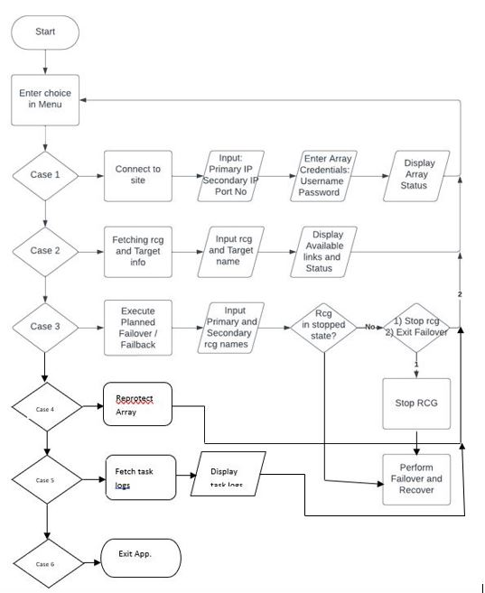

# Recovery Adapter – Storage Disaster Recovery CLI

## Overview

Recovery Adapter is a **Golang-based command line interface (CLI) tool designed to automate disaster recovery workflows for enterprise storage systems**.

The project was developed during **Storage Creative Days 2023 at Hewlett Packard Enterprise**, where it was recognized as a **Top 5 innovation among all submitted projects**.

The tool simplifies complex failover operations between replicated storage arrays by providing a structured CLI interface that orchestrates multiple disaster recovery steps through **REST API calls**.

---

## Motivation

Enterprise systems typically maintain **replicated copies of data across multiple locations** (primary and secondary sites) to ensure recovery during infrastructure failures.

However, after a failover event, storage arrays can sometimes enter **inconsistent replication states**. Recovering from these states often requires executing several commands in a **strict sequence**. Executing these steps incorrectly can delay recovery or introduce additional system issues.

Recovery Adapter was built to address this challenge. The tool understands the different replication states of the storage system and automatically executes the correct recovery operations based on the current system state.

In traditional enterprise storage environments, disaster recovery operations such as **failover, recovery, reprotect, and failback** often involve multiple manual steps.

This can lead to:

- Increased recovery time during outages
- Operational complexity for engineers
- Higher risk of human error
- Manual intervention during critical incidents

Recovery Adapter addresses these challenges by providing a **menu-driven CLI that automates the complete disaster recovery workflow**.

---

## Key Features

- Menu-driven CLI interface for simplified recovery operations
- Automated disaster recovery workflows
- Remote Copy Group (RCG) status monitoring
- Storage array connection management
- Task monitoring and debugging logs
- Robust error handling for invalid inputs and system states

---

## Disaster Recovery Workflow

The CLI automates the following enterprise storage operations:

### 1. Failover

Switch workloads from the protected primary site to the recovery site.

### 2. Recovery

Bring storage arrays into a consistent operational state after a failover event.

### 3. Reprotect

Reverse the replication direction to protect the newly active primary site.

### 4. Failback

Restore the system to its original configuration once the primary site is available again.

---

## Workflow Diagram

The following diagram illustrates the automated disaster recovery workflow implemented by the CLI tool.

---

## Demo Video

Watch the CLI demonstration here:

▶️ [Recovery Adapter Demo Video](https://drive.google.com/file/d/1t5wWO1YMTTeHRi64DE6xV4OUvaG3yYGY/view?usp=drive_link)

---

## System Architecture

The CLI tool interacts with enterprise storage arrays using REST APIs.

Workflow:
User CLI Input
→ CLI Command Handler
→ REST API Calls
→ Storage Array Operations
→ Status Monitoring

The tool validates system state before executing operations to ensure **safe and reliable recovery execution**.

---

## Tech Stack

### Language

- Go (Golang)

### Technologies

- REST APIs
- JSON
- CLI Application Design

### Tools

- Postman (API testing)
- MTPuTTY
- Visual Studio Code

---

## Achievement

🏆 **Top 5 Project – Storage Creative Days 2023**  
Hewlett Packard Enterprise

---

**Note:** This project was developed as part of the **HPE Storage Creative Days Hackathon 2023**.  
Due to company ownership policies, the source code cannot be publicly shared.  
This repository contains **documentation, architecture explanations, and a demonstration of the working prototype**.

---

## Author

**Shrey Deshmukh**
