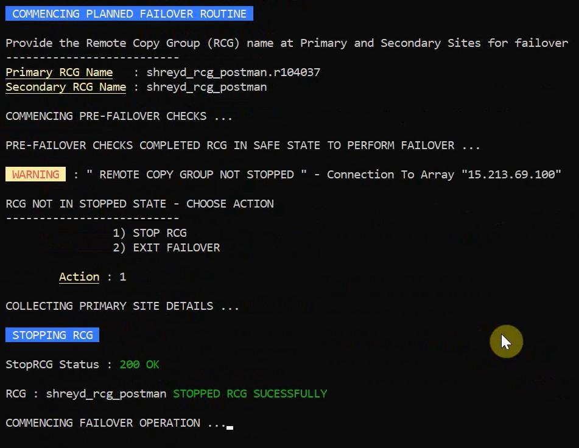

# Recovery Adapter – Storage Disaster Recovery CLI

⚠️ **Note:** The source code for this project cannot be publicly shared due to company ownership policies.
This repository contains documentation, workflow explanations, and a demonstration of the working prototype.

---

# Overview

Recovery Adapter is a **Golang-based command line interface (CLI) tool designed to automate disaster recovery workflows for enterprise storage systems**.

This project was developed during **Storage Creative Days 2023 at Hewlett Packard Enterprise**, where it was recognized as a **Top 5 innovations at Storage Creative Days 2023**.

The tool simplifies complex failover operations between replicated storage arrays by providing a structured CLI interface that automates multiple disaster recovery steps through **REST API calls**.

---

# Motivation

In enterprise storage environments, disaster recovery operations such as **failover, recovery, reprotect, and failback** typically require executing several CLI commands in a specific sequence.

This can lead to:

* Long recovery times during system failures
* Increased complexity for new engineers
* Risk of incorrect command execution
* Manual intervention during critical incidents

Recovery Adapter addresses these challenges by providing a **menu-driven CLI that automates these workflows**.

---

# Key Features

* Menu-driven CLI interface
* Automated disaster recovery workflows
* Remote Copy Group (RCG) status monitoring
* Array connection management
* Task monitoring and debugging logs
* Robust error handling for invalid inputs and system states

---

# Disaster Recovery Workflow

The CLI automates the following enterprise storage operations:

### 1. Failover

Switch workloads from the protected site to the recovery site.

### 2. Recovery

Bring the storage arrays into a consistent operational state.

### 3. Reprotect

Reverse the replication direction to protect the new primary site.

### 4. Failback

Restore the system to its original configuration.

---

# Workflow Diagram

The following diagram illustrates the automated disaster recovery workflow implemented by the CLI tool.

---

## Demo Video

Click the thumbnail below to download and watch the CLI demonstration.

---

# System Architecture

The CLI tool interacts with enterprise storage arrays using REST APIs.

Workflow:

User CLI Input
→ CLI Menu Handler
→ REST API Calls
→ Storage Array Operations
→ Status Monitoring

---

# Tech Stack

**Language**

* Go (Golang)

**Technologies**

* REST APIs
* JSON
* CLI Application Design

**Tools**

* Postman (API testing)
* MTPuTTY
* Visual Studio Code

---

# Achievement

🏆 **Top 5 Project – Storage Creative Days 2023**
Hewlett Packard Enterprise

---

# Author

**Shrey Deshmukh**
